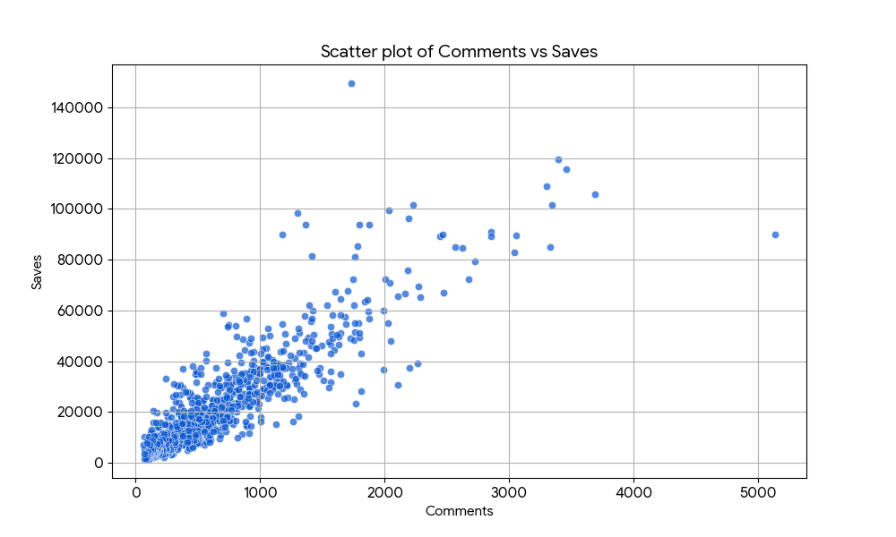

# 新規出店に向けた投資最適化と集客ドライバーに関する分析レポート

<strong>作成者:</strong> [山田智理]

## 1. エグゼクティブ・サマリー（結論）

本レポートでは、飲食店プラットフォームのデータを基に、新規出店時における効果的な投資先を検証しました。分析の結果、**「駐車場」や「個室」といった物理的設備（ハード面）への投資は集客や高評価に直結しない**ことが判明しました。

クライアント様におかれましては、設備投資への予算を最小限に抑え、見込み客（保存数）を強力に牽引する「口コミ（コメント数）の獲得」や「店舗評価の向上」に繋がるサービス・体験価値（ソフト面）へリソースを集中させることを提案いたします。

---

## 2. 分析の前提とデータ加工手法

本分析では、目視や感覚による判断を排除し、厳密なデータ分析に基づく意思決定を行うため、以下の処理を実施しました。

* **質的データの定量化（ダミー変数化）**
  「個室の有無」というテキストデータ（質的データ）は、そのままでは統計モデル（回帰分析）で計算することができません。そのため、「個室あり＝1」「それ以外（なし・情報なし）＝0」という数値（ダミー変数）に変換するデータ加工を適切に行い、エラーなく精度の高い分析を実行する環境を整えました。

---

## 3. 仮説検証と統計的解釈

### ① 駐車場の有無は店舗評価を高めるか？（t検定による検証）

* **クライアント様の仮説**：「駐車場がある方が、遠方からの集客が見込めるため評価が高くなるのではないか」
* **分析結果**：駐車場「なし」の店舗の方が、平均評価が高い。
  * 駐車場ありの平均評価：3.620
  * 駐車場なしの平均評価：3.647

**【統計的な解釈】**
この平均値の違いが「偶然起きた誤差」なのか「意味のある差」なのかを、t検定を用いて検証しました。結果として、**P値（確率）は 0.0018** となりました。

これは、統計学の基準（有意水準5%＝P値が0.05未満）を大きく下回っています。つまり、「駐車場の有無で評価に差はない（帰無仮説）」と仮定した場合、今回のデータのような差が偶然生まれる確率はわずか0.18%しかないことを意味します。
したがって、**「駐車場の有無によって評価には統計的に有意な差がある」と断定でき、かつデータ上は「駐車場がない店舗の方が評価が高い」ため、クライアント様の仮説は棄却**されます。

### ② コメント数と保存数の関係性（散布図による視覚化）

顧客の実際の来店・アクションを示す「コメント数」と、関心度を示す「保存数」の関係を可視化したものが以下の散布図です。

**【統計的な解釈】**
この2つの変数の相関係数は約0.89であり、統計的に**「非常に強い正の相関」**があることが確認されました。グラフからも読み取れる通り、コメント数が多い店舗ほど比例して保存数も多くなるという明確なトレンドが存在します。

### ③ 保存数（見込み客）を増やす要因は何か？個室は有効か？（重回帰分析による検証）

「保存数」を増やす要素を特定するため、「評価」「コメント数」「個室の有無（ダミー変数）」の3つを要因として重回帰分析を行いました。（※モデルの予測精度を示す決定係数 R² は0.814と非常に高く、信頼できる結果です）

* **評価の影響**：係数 26820.0（P値 0.000）＝ 評価が上がるほど保存数は大きく増加。
* **コメント数の影響**：係数 28.09（P値 0.000）＝ コメントが増えるほど保存数も連動して増加。
* **個室の有無の影響**：係数 -2814.56（P値 0.000）＝ **個室がある店舗は、ない店舗に比べて保存数が約2814件減少**する。

**【統計的な解釈】**
全ての要因においてP値が0.000（< 0.05）となり、統計的に有意であることが確認されました。特筆すべきは個室の影響です。単なる数字のマイナスではなく、統計的に「個室を設けることは保存数に対して明確にマイナスに作用する」という事実が証明されました。

---

## 4. 新規出店に向けた戦略的提案（結論）

以上の客観的な分析結果（事実）に基づき、クライアント様に対し以下の戦略を提案いたします。

<strong>提案①：駐車場・個室などの設備投資は見送る（コスト削減）</strong> 
データが示す通り、駐車場の確保は評価向上に寄与せず（むしろ駐車場なしの方が高評価）、個室の設置は保存数（見込み客）を減少させる要因となります。これは、駐車場がない駅前などの好立地店が結果的に人気を集めていることや、個室によってターゲット層（用途）が限定され、幅広いユーザー層の関心を失っている可能性を示唆しています。<strong>これらの設備投資には予算を割かない</strong>という決断が合理的です。

<strong>提案②：好立地の確保と「口コミ（コメント）」を誘発する施策への集中投資</strong> 
削減した設備投資の予算は、見込み客（保存数）を劇的に引き上げる「評価」と「コメント数」の獲得に全振りすべきです。  
具体的には、アクセスの良い立地（駐車場不要エリア）のテナント料への投資、または来店客が思わず写真を撮りたくなるような看板メニューの開発や、口コミを生む質の高い接客教育（ソフト面）への投資が、最も費用対効果の高い集客ドライバーとなります。顧客体験の向上がコメントを生み、それが高い評価と保存数を連れてくるという好循環の構築を最優先事項として推奨いたします。

